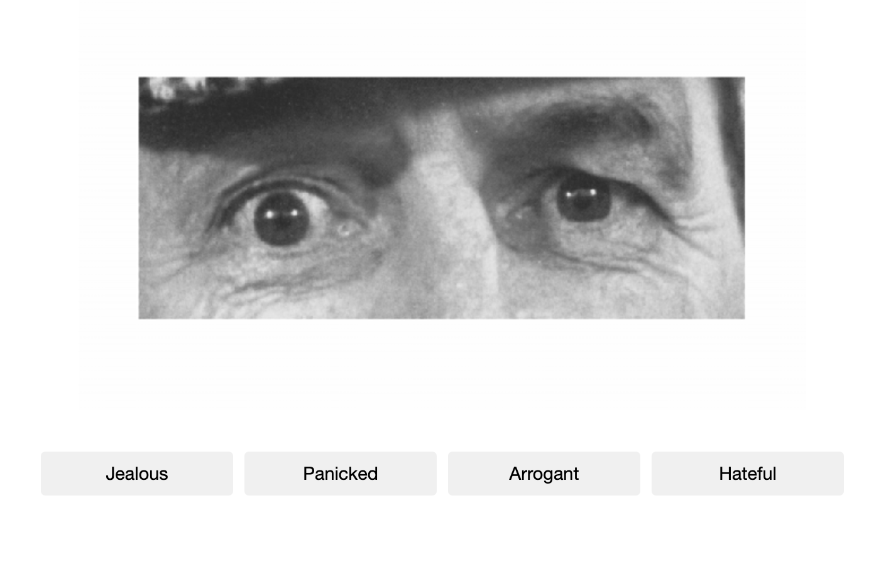

# Minerva Project: Word Puzzles Experiment Data
 
 This repo contains R code files for data preparation and summarization associated with the word puzzles experiment conducted under the Minerva project. Supplementary information about the data is available in [this Google Sheet](https://docs.google.com/spreadsheets/d/156uiHYXigYihKN6WHiC477xpLJ7OpeY8GpnTeZHYblo/edit?usp=sharing).

 ## Qualtrics Survey Data

Qualtrics was used to administer a set of measures of individual attributes in addition to perceptions of team process. Individual attribute measures include: psychological collectivism, dominance, theory of mind, and personality. Participants were also asked to report stress and workload levels. Participants assigned to the real group condition additionally provided responses to a team process measure. 

### Psychological Collectivism

A 15-item measure of psychological collectivism developed and validated by Jackson and colleagues (2006) was used in the study. The measure captures five facets of of collectivism: preference, reliance, concern, norm acceptance, and goal priority  (3 items per facet). Collectivism was measured at two points in the study. The data labels include information about measurement time. For example, for the item "*I preferred to work in those groups rather than working alone.*", the data are labeled collectivism_t1_1 and collectivism_t2_1 to represent time 1 and time 2 measurements, respectively. 

According to Jackson et al. (2006):
* Preference and concern facets are relevant to cooperation as they "create a sense of attraction in the group"
* Goal priority and reliance facets are relevant to cooperation as they "facilitate the development of interdependence"
* Norm acceptance facet is relevant to cooperation, specifically prosocial behavior

*Scoring*

Responses are provided on a 5-point Likert-type scale ranging from strongly disagree (1) to strongly agree (5), and can be assessed at the scale level (single variable) or facet level (five variables). 
Mean ratings, at the scale or facet level, are used to determine level of collectivism, where a higher value indicates greater collectivism. 

| Label  | Item  | Facet |
| :------------- | :------------- | :------------- |
| collectivism_1  | I preferred to work in those groups rather than working alone.  | preference  |
| collectivism_2  | Working in those groups was better than working alone.  | preference  |
| collectivism_3  | I wanted to work with those groups as opposed to working alone.  | preference  |
| collectivism_4  | I felt comfortable counting on group members to do their part.  | reliance  |
| collectivism_5  | I was not bothered by the need to rely on group members.  | reliance  |
| collectivism_6  | I felt comfortable trusting group members to handle their tasks.  | reliance  |
| collectivism_7  | The health of those groups was important to me.  | concern  |
| collectivism_8  | I cared about the well-being of those groups.  | concern  |
| collectivism_9  | was concerned about the needs of those groups.  | concern  | 
| collectivism_10  | I followed the norms of those groups.  | norm acceptance  | 
| collectivism_11  | I followed the procedures used by those groups.  | norm acceptance  | 
| collectivism_12  | I accepted the rules of those groups.  | norm acceptance  | 
| collectivism_13  | I cared more about the goals of those groups than my own goals.  | goal priority  | 
| collectivism_14  | I emphasized the goals of those groups more than my individual goals.  | goal priority  | 
| collectivism_15  | Group goals were more important to me than my personal goals.  | goal priority  | 

### Sociable and Aggressive Dominance

A 15-item measure of dominance (Kalma et al., 1993) was used in the study. The measure captures two distinct forms of dominance: sociable (8 items) and aggressive (7 items). Dominance was measured at two points in the study. The data labels include information about measurement time. For example, for the item "*I have no problems talking in front of a group.*", the data are labeled dominance_t1_1 and dominance_t2_1 to represent time 1 and time 2 measurements, respectively. 

| Label  | Item  | Subscale |
| :------------- | :------------- | :------------- |
| dominance_1 | I have no problems talking in front of a group. | sociable |
| dominance_2 | At school I found it easy to talk in front of the class. | sociable |
| dominance_3 | No doubt I’ll make a good leader. | sociable |
| dominance_4 | I certainly have self-confidence. | sociable |
| dominance_5 | For me it is not hard to start a conversation in a group. | sociable |
| dominance_6 | I am not shy with strangers. | sociable |
| dominance_7 | I like taking responsibility. | sociable |
| dominance_8 | People turn to me for decisions. | sociable |
| dominance_9 | I can look everybody in the eye, and lie with a straight face. | aggressive |
| dominance_10 | I can lie without anybody noticing it. | aggressive |
| dominance_11 | I find it important to get my way. | aggressive |
| dominance_12 | I find it important to get my way, even if this causes a row. | aggressive |
| dominance_13 | I quickly feel aggressive with people. | aggressive |
| dominance_14 | I make smart, sarcastic remarks if people deserve it. | aggressive  |
| dominance_15 | I’d rather be disliked (for being unkind) and that people look down on me (for not achieving my aims). | aggressive |

*Scoring*

Responses are provided on a 7-point Likert-type scale ranging from strongly disagree to strongly agree and should be assessed at the subscale level. Mean ratings are used to determine level of dominance, where a higher value indicates higher dominance. 

### Theory of Mind

Individual differences in mentalizing ability was assessed using the 36-item Reading the Mind in the Eyes Test (Baron-Cohen et al., 2001). For each item, a pair of eyes is displayed and participants choose one of four word options that describes the
expression being conveyed.  

*Scoring*

Responses are scored as correct (1) or incorrect (0), and the percentage correct across all items is used to determine mentalizing ability. 

<figure>
  
  

  <figcaption>A practice item provided in the RME test.</figcaption>
</figure>

### Personality

The Ten Item Personality Inventory (TIPI) developed by Gosling and colleagues (2003) was used in the study. The TIPI is used to measure the Big-Five personality dimensions: Extraversion, Agreeableness, Conscientiousness, Emotional Stability, Openness to Experiences.

*Scoring*

Responses are provided on a 7-point Likert-type scale ranging from strongly disagree to strongly agree. A subset of the items need to be reverse scored: 2, 4, 6, 8, and 10. Mean ratings of the two items for each personality scale are used to calculate scores (see table below).

Recode as follows:
* 7 = 1
* 6 = 2
* 5 = 3
* 4 = 4
* 3 = 5
* 2 = 6
* 1 = 7

| Label  | Item  | Scale |
| :------------- | :------------- | :------------- |
| TIPI_1 | Extraverted, enthusiastic | Extraversion |
| TIPI_2* | Critical, quarrelsome | Agreeableness |
| TIPI_3 | Dependable, self-disciplined | Conscientiousness |
| TIPI_4* | Anxious, easily upset | Emotional Stability |
| TIPI_5 | Open to new experiences, complex | Openness to Experiences |
| TIPI_6* | Reserved, quiet | Extraversion |
| TIPI_7 | Sympathetic, warm | Agreeableness |
| TIPI_8* | Disorganized, careless | Conscientiousness |
| TIPI_9 | Calm, emotionally stable | Emotional Stability |
| TIPI_10* |  Conventional, uncreative | Openness to Experiences |

Asterisk denotes reverse-scored item.

Additional information is available at this [link](https://gosling.psy.utexas.edu/scales-weve-developed/ten-item-personality-measure-tipi/).

*Analysis*

Group personality composition can be assessed as a predictor of group effectiveness. 

* Prior research suggests there is negative relationship between the variance of personality scores within a group and group effectiveness such that heterogeneous groups are less effective and homogeneous groups are more effective (Halfhill et al., 2005). 
  * Mechanism: heterogeneity is associated with conflict.
  * Operationalizing heterogeneity: (1) variance of individual scores, (2) range of individual scores, or (3) proportion of team members that posses a trait 
* Minimum and maximum scores can also potentially have predictive utility under the assumption that one individual can significantly affect group outcome. It is suggested that, for problem solving groups, the max score can be used in analysis.
* For collaborative work, it is expected that relationship-oriented traits will be important: agreeableness and emotional stability (Halfhill et al., 2005). 

### Stress

A validated single item stress scale (Booth et al., 2022) was used in the study. Responses to the question “*Overall, how would you rate your current level of stress?*” are provided on a 5-point Likert-type scale: 1 = No stress at all, 2 = Very little stress, 3 = Some stress, 4 = A lot of stress, 5 = A great deal of stress. According to Booth et al. (2002), perceived stress, as measured using this scale, is positively associated with state and trait anxiety, negative affect, and neuroticism and negatively associated with positive affect.

### Workload

A single item workload scale (Fiore et al., 2017) was used in the study. Responses to the question "*How easy or difficult was it to complete the task?*" are provided on a 7-point Likert-type scale ranging from very easy (1) to very difficult (7).

### Team Processes

A measure of team process was used in the study. Specifically, the 10-item short form version of Mathieu et al. (2020)'s team process measure was adminstered to participants in the real group condition. The measure contains three subscales representing second-order team process constructs: Transition Processes, Action Processes, and Interpersonal Processes. Responses are provided on a 5-point Likert-type scale: 1 Not at all; 2 Very litte; 3 To some extent; 4 To a great extent; 5 To a very great extent.

*Scoring*

Transition Processes 
| Label  | Item  | Facet |
| :------------- | :------------- | :------------- |
| mission_analysis | Identify the key challenges that we expect to face? | Mission Analysis |
| goal_specification | Ensure that everyone on our team clearly understands our goals? | Goal Specification |
| strategy_formulation | Develop an overall strategy to guide our team activities? | Strategy Formulation and Planning |

Action Processes 
| Label  | Item  | Facet |
| :------------- | :------------- | :------------- |
| monitoring_progress | Regularly monitor how well we are meeting our team goals? | Monitoring Progress Toward Goals |
| systems_monitoring | Monitor important aspects of our work environment? | Systems Monitoring |
| team_monitoring | Assist each other when help is needed? | Team Monitoring and Backup |
| coordination | Coordinate our activities with one another? | Coordination |

Interpersonal Processes
| Label  | Item  | Facet |
| :------------- | :------------- | :------------- |
| conflict_management| Deal with personal conflicts in fair and equitable ways? | Conflict Management |
| motivating | Encourage each other to perform our very best? | Motivating and Confidence Building |
| affect_management | Keep a good emotional balance in the team? | Affect Management |

## Joggle Cognition Battery Data

The Joggle application was used to administer a cognition test battery. The battery contains # tests:

### 

## References

Baron-Cohen, S., Wheelwright, S., Hill, J., Raste, Y., & Plumb, I. (2001). The “Reading the Mind in the Eyes” Test Revised Version: A study with normal adults, and adults with Asperger Syndrome or high-functioning Autism. The Journal of Child Psychology and Psychiatry and Allied Disciplines, 42(2), 241–251.

Booth, B. M., Vrzakova, H., Mattingly, S. M., Martinez, G. J., Faust, L., & D’Mello, S. K. (2022). Toward robust stress prediction in the age of wearables: Modeling perceived stress in a longitudinal study With information workers. IEEE Transactions on Affective Computing, 13(4), 2201–2217.

Fiore, S. M., Warta, S. F., Best, A., Newton, O. B., & LaViola, J. J. (2017). Developing a theoretical framework of task complexity for research on visualization in support of decision making under uncertainty. Proceedings of the Human Factors and Ergonomics Society Annual Meeting, 61(1), 1193–1197. 

Gosling, S. D., Rentfrow, P. J., & Swann, W. B., Jr. (2003). A very brief measure of the big five personality domains. Journal of Research in Personality, 37, 504-528.

Halfhill, T., Sundstrom, E., Lahner, J., Calderone, W., & Nielsen, T. M. (2005). Group personality composition and group effectiveness: An integrative review of empirical research. Small Group Research, 36(1), 83–105.

Jackson, C. L., Colquitt, J. A., Wesson, M. J., & Zapata-Phelan, C. P. (2006). Psychological collectivism: A measurement validation and linkage to group member performance. Journal of Applied Psychology, 91(4), 884.

Kalma, A. P., Visser, L., & Peeters, A. (1993). Sociable and aggressive dominance: Personality differences in leadership style?. The Leadership Quarterly, 4(1), 45-64.

Mathieu, J. E., Luciano, M. M., D’Innocenzo, L., Klock, E. A., & LePine, J. A. (2020). The development and construct validity of a team processes survey measure. Organizational Research Methods, 23(3), 399–431.
